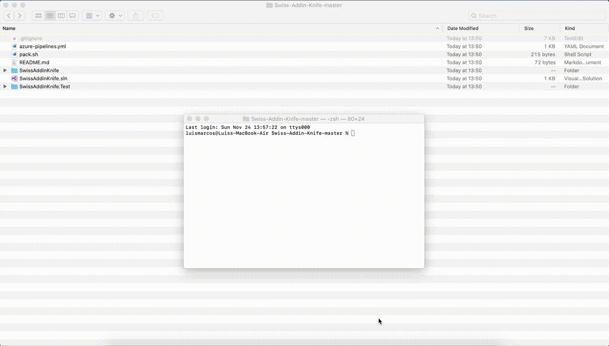
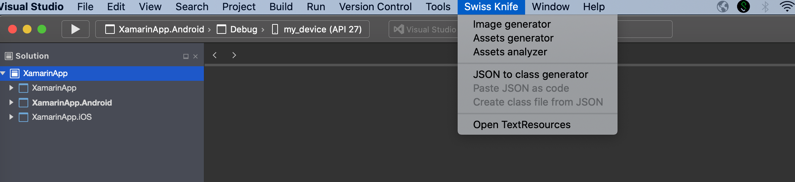
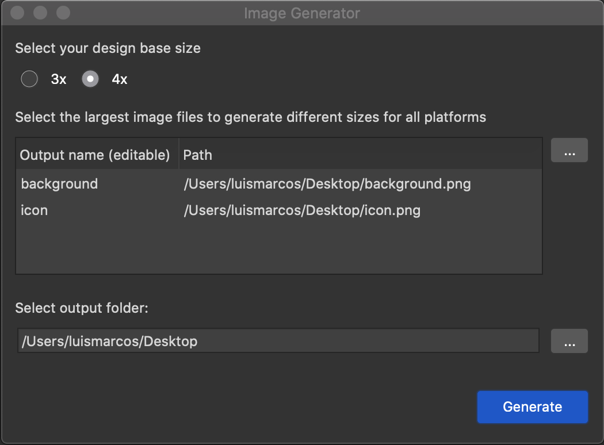
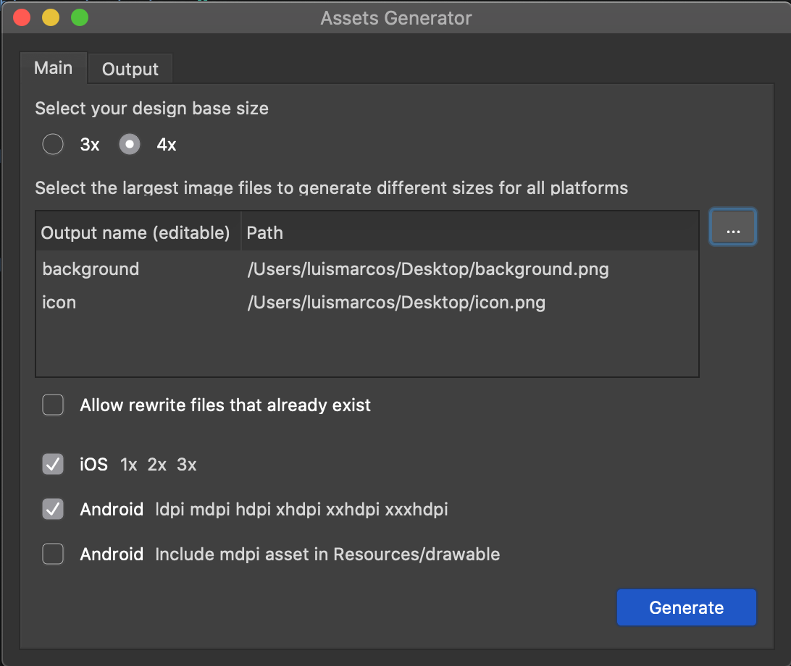
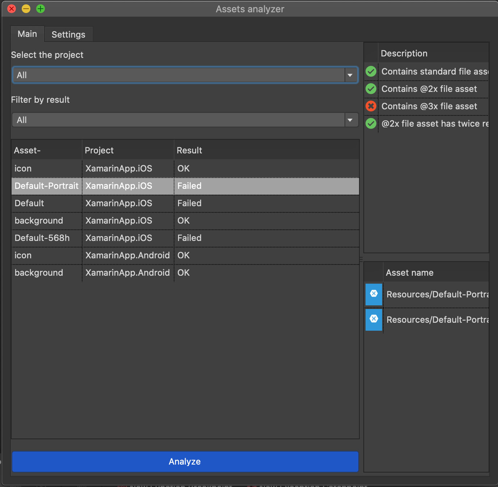
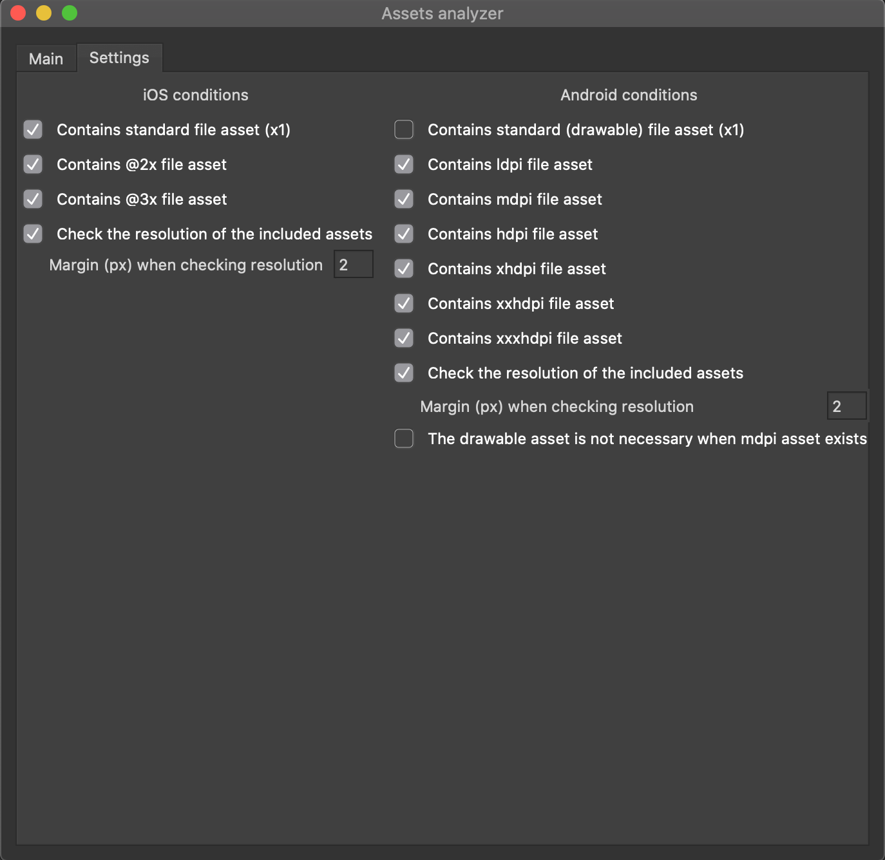
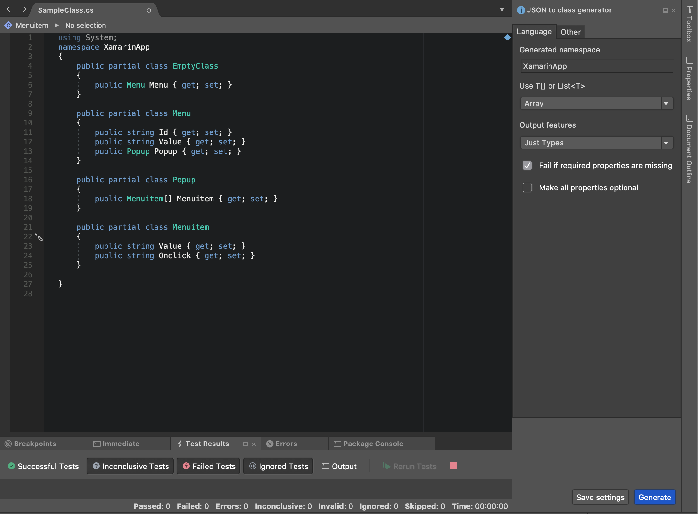
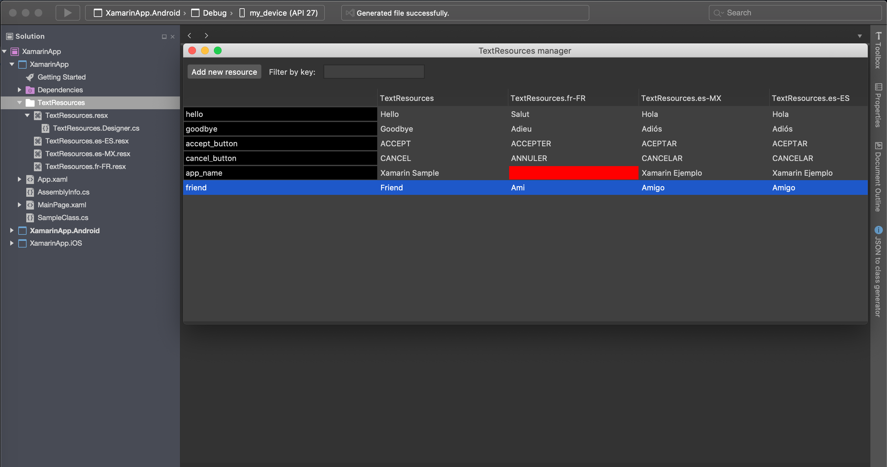

# Swiss-Addin-Knife
A Visual Studio for macOS Addin with multiple tools

run 'sudo bash pack.sh' to create mpack

## Features

#### Image generator
- Generate images with the appropriate sizes for iOS and Android.
- Generation based on a 3x or 4x image.

#### Assets generator
- Resize your images and add them directly to your iOS or Android resources folder.

#### Image analyzer
- Analyze your images of your iOS and Android projects to see if you have forgotten to add any size.
- Configure the analyzer to find the sizes you need.

#### JSON to class
- Generate your classes from JSON.

#### Manage your TextResources
- Edit all your TextResources from one place.

